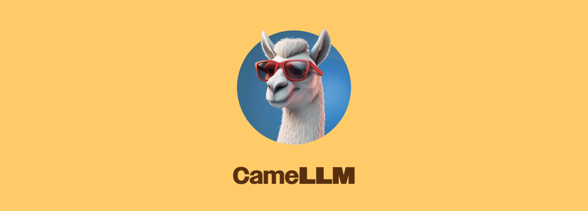

**[CameLLM](https://github.com/CameLLM)** is a collection of Swift packages to support running LLMs (including the LLaMA family and GPT-J models) locally on macOS (and hopefully in the future, iOS) with modern, clean, Swift bindings 🚀

## 🐪 This repository

CameLLM is plugin-based and this is the main CameLLM repo, which exposes shared and abstract types which can be implemented by plugins and used by clients of the CameLLM family of packages.

## ⚠️ Status

This project is still under development, but is being built to power version 2 of [LlamaChat](http://github.com/alexrozanski/LlamaChat).

## Packages

The core of CameLLM is implemented through several main packages:
- **[CameLLM/CameLLM](https://github.com/CameLLM/CameLLM) (this repo):** Provides shared and abstract types used by implementing plugins and clients of CameLLM.
- **[CameLLM/CameLLM-Common](https://github.com/CameLLM/CameLLM-Common):** Provides shared classes in both Swift and Objective-C++ which can be used by implementing plugins.
- **[CameLLM/CameLLM-Plugin-Harness](https://github.com/CameLLM/CameLLM-Plugin-Harness):** Provides (mostly) abstract types which can be used by implementing plugins, as well as some shared classes which can be utilised by plugins.

Current CameLLM plugins:
- **[CameLLM/CameLLM-Llama](https://github.com/CameLLM/CameLLM-Llama):** Uses the work from [llama.cpp](https://github.com/ggerganov/llama.cpp) to implement support for the LLaMA family of models.
- **[CameLLM/CameLLM-GPTJ](https://github.com/CameLLM/CameLLM-Llama):** Uses the work from [llama.cpp](https://github.com/ggerganov/llama.cpp) and [nomic-ai/gpt4all-chat](https://github.com/nomic-ai/gpt4all-chat) to implement support for GPT-J models.

## 🏛️ Architecture

All of the CameLLM packages are available through the Swift Package Manager.

Since most work to date which supports the running of LLMs locally on macOS and iOS has been done by [llama.cpp](https://github.com/ggerganov/llama.cpp) and [ggml](https://github.com/ggerganov/ggml) which are written in C and C++, most of the CameLLM packages have both Swift and Objective-C++ packages, named `<PackageName>` and `<PackageName>ObjCxx` respectively.
